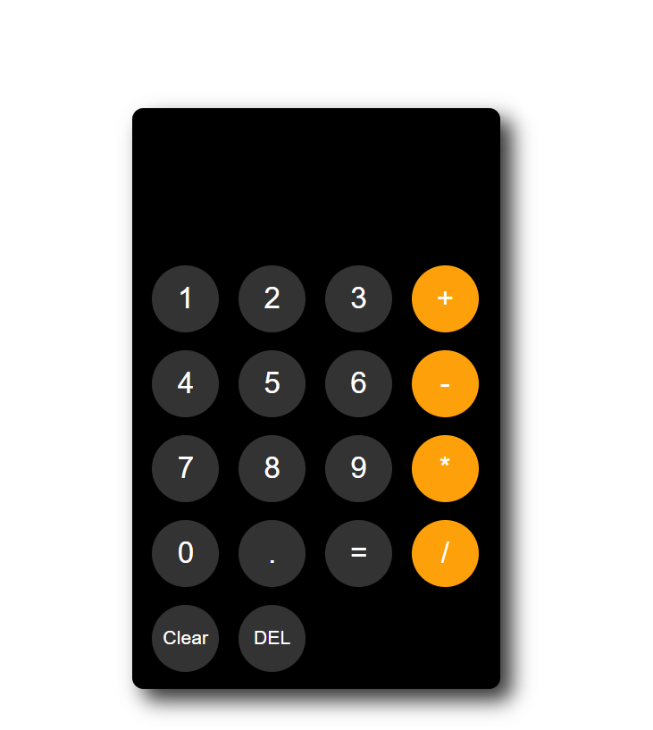

# Calculator Project

A simple **web-based calculator** built with **HTML, CSS, and JavaScript** that supports persistent storage, DEL/Clear functionality, and a fixed button layout.

## Features

- Basic arithmetic operations: `+`, `-`, `*`, `/`
- Decimal numbers supported
- **Persistent calculation** using `localStorage`
- **DEL button** removes last character
- **Clear button** resets the calculator
- **Scrollable display** for long equations
- Buttons remain **fixed at the bottom** of the calculator
- Fixed display height prevents layout shift

## Demo

You can view the live project here: [Calculator Demo](https://calculator-1849.netlify.app/)

## Screenshot

## How It Works

- The variable `calculation` stores the current input.
- Clicking a number/operator button appends to `calculation` and updates the display (`.js-answer`) and `localStorage`.
- Pressing `=` evaluates the expression using `eval()` and updates the display with the result.
- Pressing **DEL** removes the last character and updates both the display and `localStorage`.
- Pressing **Clear** resets the calculation and the display.
- The display area has a **fixed height** and scrolls horizontally for long equations, so buttons never shift.

## Usage

1. Open `index.html` in a modern browser.
2. Use the number and operator buttons to input your calculation.
3. Press `=` to evaluate and show the answer.
4. Use **DEL** to remove the last character.
5. Use **Clear** to reset the calculator.

## Technologies Used

- **HTML5** – for page structure
- **CSS3** – for fixed layout, scrolling display, and button styling
- **JavaScript** – for interactive calculator logic and persistent storage

## Notes

- The display is **right-aligned** and scrollable horizontally to handle long equations.
- LocalStorage ensures your last calculation persists across page reloads.
- The buttons are always **pinned at the bottom** of the calculator for consistent layout.

